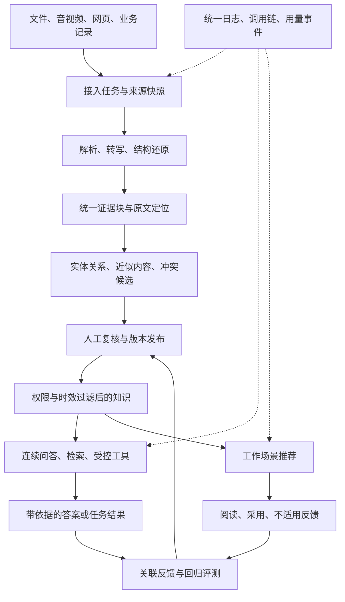

**地铁行业知识库五项能力升级设计**

设计日期：2026年9月8日。状态：待实施设计。本文件明确目标行为、模块边界、数据契约与验收方法，不代表所列新增能力已经开发或通过验收。

本次范围：数据预处理、推理生成、知识推荐、统一日志与调用链、语义去重与内容冲突识别。沿用现有 React/Vite、Node.js、SQLite 和文档治理流程，按需增加独立解析服务。继续保留本机免登录；岗位场景选择不授予权限、不冒充员工身份。

**一、设计目标与现有基础**

目标是让平台能够读懂更多资料、连续理解问题、调用可核验的业务工具、在工作中推荐适用知识，并能追踪每次处理的来源、过程和结果。

| 能力 | 现有基础 | 本次升级后的用户可见结果 |
| --- | --- | --- |
| 数据预处理 | 常见文档、OCR、CSV/XLSX整行证据、原件与版本 | 表格能回到具体单元格，音视频能回到时间点；网页和业务记录有更新状态；实体与关系可回查出处 |
| 推理生成 | 单轮证据问答、引用检查、拒答和原文回退 | 能承接追问，显示实际处理进度；统计有计算过程，任务有步骤与状态，业务模板可评测和回退 |
| 知识推荐 | 收藏、最近更新、固定提问示例 | 根据主动选择的工作场景和当前对象推荐，并解释推荐原因和适用范围 |
| 日志与调用链 | 基础运行指标、任务和业务审计 | 从一次失败定位到解析、检索、模型或工具步骤，关联耗时、重试和用量 |
| 去重与冲突 | 文件哈希去重、版本、有效期、人工反馈 | 识别近似内容与条款差异；管理员能对照原文处理，问答不会把未解决的差异写成统一结论 |

当前表格能力是完整记录聚合与覆盖校验，尚无确定性统计引擎；会话保存尚不等于模型获得历史；已有文件哈希去重不等于语义去重。这三处是本次设计的明确增量。[现有验收记录](D:/ai-project/ai-rag/docs/知识库优化验收报告-2026-09-08.md)

图中是目标处理关系；自动处理完成后仍须通过现有审核发布流程。

**二、五项能力共用的数据基础**

将现有片段扩展为 EvidenceBlock。所有新增能力都引用同一份证据，避免解析、问答、推荐分别保存一套无法对应的内容。

| 对象 | 建议关键字段 | 必须遵守的约束 |
| --- | --- | --- |
| 来源快照 SourceSnapshot | sourceId、externalId、sourceRevision、contentHash、capturedAt、sourceKind、applicability、permissionMappingVersion、freshnessState | 抓取时间和来源发布时间分开；无可靠来源权限映射的业务记录进入隔离待处理，不能默认全员可见 |
| 证据块 EvidenceBlock | id、documentId、documentVersion、blockRevision、type、text、structuredData、locator、contentHash、parserVersion、quality、reviewState | 类型支持 paragraph/table/chart/transcript；保留原文与提取值，不用模型解释覆盖原件 |
| 来源定位 Locator | page、bbox、sheet、cellRange、rowNumbers、startMs、endMs、webSnapshotId、externalRecordId | 按来源类型选择；网页定位指向采集快照；Word逻辑页不能标成打印页；CSV记录号不能误写为物理文本行 |
| 抽取事实 Assertion | subjectId、predicate、object/value、unit、condition、validFrom/To、scope、evidenceRefs、extractorVersion、reviewState | 每条关系和数值都绑定证据；没有出处的推断不作为正式知识关系 |
| 执行记录 Run/Step | runId、conversationId、turnId、stepId、attempt、status、inputRevision、resultRef、traceId、budget | 处理状态与文档发布状态独立；结果引用绑定版本，重试不能重复提交结果 |
| 业务模板 PromptVersion | templateId、version、scenario、inputSchema、outputSchema、allowedTools、modelProfile、evaluationRef、status | 发布版本不可原地修改；记录实际使用的版本；回退只影响新运行 |
| 治理问题 KnowledgeIssue | type、evidenceRefs、scopeFingerprint、candidateReason、status、assignee、dueAt、resolution、decisionRevision | 候选结论、人工结论和已过时结论分开；范围或正文变化后重新核验 |
| 推荐记录 Recommendation | requestId、contextId、items、reasonCodes、policyVersion、generatedAt、expiresAt | 生成与展示时均校验权限、有效期和版本；本机contextId只区分工作场景，不代表个人身份 |

质量字段按文本、数字、表格结构、时间定位分别记录方法与评分；没有评分的引擎返回 unknown，不填默认100分。算法分数用于复核排序，不对用户宣称为事实正确概率。

派生数据统一保存依赖键：`documentVersion + blockRevision + contentHash + scopeFingerprint + algorithmVersion`。正文校对、适用范围变更、权限变更、发布或下架触发失效事件。仅创建草稿不撤销仍有效的旧正式版本。检索、推荐、缓存及会话摘要应在下一次使用前完成版本和权限复查。

**三、数据预处理层设计**

**3.1 统一接入流程**

用户仍先看到文件列表，再选择“上传资料 / 添加网页来源 / 添加业务来源”。提交后显示真实阶段：已接收、排队、解析、提取结构、质量检查、待复核、完成；失败显示具体阶段及可重试原因。完成表示本次处理结束，发布状态另行显示。

流程为：接收与格式校验 → 保存原件/来源快照及哈希 → 分类选择解析器 → 页面或时间片任务 → 结构化证据 → 质量检查 → 去重/冲突候选 → 人工复核 → 发布与建立索引。

任务保存总页数或总时长、已处理范围、失败范围、尝试次数和检查点。达到资源上限时明确报告“部分处理”，不得把前20页解析成功显示为全文件成功。续跑复用已完成结果；用户取消后保留原件和检查点。结果提交前核验输入快照、文档revision、取消状态和执行权限；旧任务不得覆盖较新的人工校对。公开问答默认只使用审核通过且覆盖要求明确的资料。

| 输入 | 处理设计 | 输出及复核重点 |
| --- | --- | --- |
| 原生PDF | 保留文本坐标；识别标题、阅读顺序、页眉页脚与表格区域；困难页按需交给版式引擎 | 段落和表格均保留页码与区域框，多栏错序需可调整 |
| 扫描PDF、图片 | 方向与倾斜校正、OCR、版式识别、单元格还原；保留原图区域 | 数字、单位、小数点、设备编号和否定词单独提示核对 |
| Word、PPT | 直接读取原生段落、表格、合并单元格、图题与对象顺序；图片区域再OCR | 优先使用原生结构；Word无稳定打印页时以章节和段落定位 |
| CSV、XLSX | 继承完整表头和记录，增加字段类型、单位、缺失值、合并表头、公式及缓存值说明 | 记录总量和每行来源；不把缺失值当0，不执行文件中的宏或外部连接 |
| 图表 | 优先读取Office内嵌数据；其次识别图题、坐标轴、单位、图例、序列与可读数值 | 原生数值、识别数值、估读趋势分开；仅有趋势时不生成精确统计 |
| 音频 | 音频标准化、分段、转写、时间对齐、地铁术语校对 | 带起止时间的转写片段；低可信编号与数字待核；说话人可标A/B，不推断真实姓名 |
| 视频 | 音轨转写，并抽取关键画面及画面文字；合并时间轴证据 | 回答引用可跳转至片段；区分“画面可见”和“讲解提到”，不把培训演示视为正式规程 |
| 网页 | 限定站点及路径、提取正文与附件、保留快照、更新时间和来源地址 | 按内容变化创建版本；删除或不可达分别处理，采集失败不等于来源已删除 |
| 业务API | 配置字段映射、业务主键、更新时间游标、权限映射及状态映射 | 同步结果显示新增、更新、撤回、失败；保留可回查的源记录ID |

复杂版式的第一轮技术验证采用可替换的独立解析适配器，候选为 PaddleOCR PP-StructureV3；官方文档列有版式、表格和图表解析功能，实际地铁扫描件质量及机器资源消耗仍须用本项目样本验证。[PaddleOCR官方文档](https://www.paddleocr.ai/main/en/version3.x/pipeline_usage/PP-StructureV3.html)

音频转写首轮验证本地 Whisper 适配器，保留替换为企业指定服务的接口；其公开实现支持多语言转写。普通话、站名缩写、设备编号、噪声和时间定位分别验收，不使用公开基准替代本项目结果。[Whisper官方实现](https://github.com/openai/whisper)

当前已配置的文本问答模型继续用于文本任务；视觉和语音服务单独登记能力、处理位置和健康状态。未配置时明确显示“需要解析服务”，可上传人工转写稿，不模拟识别成功。新增云解析不能自动沿用聊天模型配置；按来源的外发策略选择本地或已启用的外部适配器。

**3.2 表格与图表的复核工作台**

文档详情增加“原文对照 / 表格数据 / 图表说明 / 音视频转写 / 实体关系”标签。左侧原件，右侧提取结果；点击单元格、数值或转写句，定位对应页面区域或时间片。

表格支持合并/拆分表头、连接跨页表格、调整列类型和单位、标记缺失记录。跨页合并保留各页定位，不仅凭相同列数拼接。图表允许确认系列名、单位与数值，也可以确认“仅可描述趋势”。修改产生证据修订并触发相关索引和关系重算；已发布资料沿用新稿审核流程。

新增确定性表格查询工具：筛选、排序、分组、计数、求和、均值及时间范围过滤由程序执行。工具返回数据快照、字段类型、过滤条件、结果、缺失项和来源行。覆盖不完整时只允许明确的局部查询，拒绝声称全量汇总；识别未确认的关键数值不进入正式计算。

**3.3 实体与关系抽取**

一期词表覆盖线路、车站、专业、设备类别、设备编号、故障、工单、制度和条款。先从表格主键与已登记编号确定实体，再用术语词表和模型补充候选。设备唯一性采用源系统与设备编号；车站名称别名必须有登记依据，不能只按名称相似度合并。

关系示例为“设备位于车站”“工单针对设备”“条款适用于设备类别”“新版本替代旧版本”。关系保存原始名称、归一ID、适用范围、时间区间、证据块和复核人。知识管理员可确认、修正、驳回；不确定指向允许保持未解析。一期可使用关系表与索引实现受控查询，独立图数据库按关系规模和查询需求评估。

**3.4 网页与业务连接器**

连接器统一提供 discover、fetch、normalize、checkpoint 四个步骤。配置包括 sourceType、目标库、允许域名/路径或企业端点、credentialRef、分页与游标、字段映射、权限映射、同步周期、删除策略、责任人、最大可接受数据延迟。

公开网页采集限定协议、站点和路径，对DNS解析及实际连接地址进行校验，重定向默认关闭；企业内网接入使用单独登记的端点，不能借公开网页入口访问任意内网地址。该边界参考 OWASP 对允许名单和重定向的建议。[OWASP SSRF防护指南](https://cheatsheetseries.owasp.org/cheatsheets/Server_Side_Request_Forgery_Prevention_Cheat_Sheet.html)

外部业务数据以 `(sourceId, externalId, sourceRevision或contentHash)` 幂等更新；批次数据与游标同事务提交，失败批次不提前推进游标。使用时间游标时采用重叠窗口和ID去重；全量同步未完整结束前不能把未见记录视为删除。明确删除产生撤回标记；短暂断连只更新新鲜度告警。权限撤销应先阻断访问，再补做索引清理；无法核验权限或超过配置的新鲜度上限时暂停服务相关数据。

首个真实业务连接选择设备台账与维修工单，只读接入；模拟接口只能用于契约测试，交付时要单独记录真实源系统验收。

文件上传沿用当前普通文档25MB入口；大媒体新增分片上传、校验与临时空间清理。建议首轮资源配置为媒体200MB/60分钟、分片8MiB、公开网页每批100页，均属于待基准验证的可配置上限。超限在接入时说明；不静默截断，也不把资源上限当作已验收处理容量。

**四、推理生成层设计**

**4.1 连续对话与上下文管理**

每轮处理：识别本轮意图 → 读取同会话已完成轮次 → 解析当前对象、范围和时间 → 必要时改写为独立问题 → 重新检索有效证据或调用工具 → 生成与检查 → 保存结果。

上下文分成三类：用户明确提供的条件；此前已确认的对象和任务状态；本轮重新取得的业务证据。历史模型回答只帮助理解话题，不能作为新的事实来源。每条摘要保留来源轮次与证据依赖，资料失效或权限撤回时重建/剔除对应内容。摘要传入模型前同样接受权限过滤，不只检查最终引用。

建议初始保留最近6个已完成轮次，较早内容压缩为对象、条件、待解决问题和证据依赖；按模型实际上下文预算动态裁剪。保留系统约束、当前问题和证据空间，优先压缩旧对话；不保存或展示模型内部思维过程作为业务记录。

例如用户先问“设备A有哪些维修记录”，再问“只看近三个月，同类故障有几次”，系统继承设备A并新增时间与分类条件。若前文有多个设备，则要求选择对象；切换到另一线路或知识库时清理不再适用的上下文。不得因岗位场景选择扩大可访问范围。

同一会话提交携带 conversationRevision 和 clientRequestId；一期同会话只允许一个未结束的问答任务，冲突返回409并提示正在处理。幂等记录以服务端主体、操作与clientRequestId作为持久唯一键，并保存请求参数指纹；同键同参数返回既有run，同键不同参数返回409。先处理重复请求，再检查会话revision；创建run、登记幂等记录及占用会话须同事务提交。旧JSON入口共用运行服务：携带请求ID时具有相同幂等保证，旧客户端未携带时只保证每次请求的结果提交不重复，不承诺跨请求自动去重。

**4.2 流式输出与答案状态**

新增事件通道，同时保留当前JSON问答接口。DeepSeek官方接口支持SSE增量响应；平台仍需自行处理断流、结束原因、用量以及证据检查，接入协议支持不等于本项目已经完成流式验收。[DeepSeek Chat Completions](https://api-docs.deepseek.com/api/create-chat-completion/)

| 页面状态 | 对应事件 | 用户看到的内容 |
| --- | --- | --- |
| 已受理 | run.started | 问题与运行编号，可取消 |
| 检索/查询中 | step.started、step.completed | 简短业务步骤，例如“查找设备记录”“核对适用规程”，不展示内部思维链 |
| 已取得依据 | evidence.ready | 当前获授权的来源与范围，仍不标为最终答案 |
| 正在回答 | answer.segment | 通过该段引用、权限及来源检查的完整段落；整体仍显示生成中 |
| 完成或回退 | answer.final | 最终答案、实际引用、模式、数据范围及必要的局限说明 |
| 待补充/部分完成 | run.waiting_input、run.partial | 显示缺少的条件或尚未完成项；补充后恢复或明确结束，不能标成全部完成 |
| 取消/中断/失败 | run.cancelled、run.interrupted、run.failed | 明确当前结果未完成，可重试；部分文本不作为已完成历史答案 |

服务器接收真实模型流，不逐字转发未经检查的原始JSON或工具参数。能完成分段检查时发送完整段落；涉及跨段统计、全局引用集合或内容冲突时，先发实际进度，再发送校验后的完整终稿。引用检查通过只代表通过相应规则，不宣称所有事实已自动核实。

最终输出前再次核验权限、来源版本、表格覆盖和全部引用。来源撤回事件要使正在展示的相关段落失效；服务端已发送内容无法保证被物理收回，因此必须在每次发送前核验。原文摘录、模型回答、依据不足仍保留不同模式。

事件包含 runId、eventId、sequence、type、timestamp、payload。完成段与终态持久保存，GET事件接口可按最后序号重放；重放每个证据事件前重新核验当前权限、版本与有效期，已失效内容改为撤回提示，不直接回放旧payload。不持久化原始token。断开SSE连接不重开模型请求；显式取消才发取消信号。进程异常终止的模型请求标记interrupted，重试创建新attempt，旧attempt的未知费用不伪记为0。

**4.3 业务提示词管理**

模板场景首批为规章问答、设备维修资料分析、交接班资料整理、培训知识整理。模板编辑器由业务目标、输入字段、输出结构、引用要求、允许工具和示例题组成。权限、禁止执行来源指令、来源类型区分等平台约束由代码固定，业务模板不能覆盖。

生命周期：草稿 → 待评测 → 待审核 → 已发布 → 已停用。每次修改产生新版本；发布前运行关联题集和权限/拒答检查，保留新旧结果对比。失败项由维护人员处理后再发布；回退恢复上一已验收版本。运行中固定模板版本，避免中途变更行为。

模板变量只允许声明字段和经过序列化的数据，不执行模板代码、不允许任意脚本。资料、网页和工具输出属于证据数据，即使出现操作命令，也不能变成系统指令。

**4.4 工具调用与多步任务**

模型负责建议调用，平台负责校验和执行。DeepSeek工具调用文档明确，具体函数需要应用实现；不能把模型返回的工具名称当作任务已完成。[DeepSeek工具调用指南](https://api-docs.deepseek.com/guides/tool_calls/)

| 首批工具 | 功能 | 可核验结果与边界 |
| --- | --- | --- |
| search_knowledge | 查询有效知识证据 | 来源版本、适用范围、片段定位 |
| query_table | 在完整结构化快照上筛选与计算 | 过滤条件、公式、行数、缺失项、来源行；不接受模型生成的任意SQL |
| compare_clauses | 对照已授权条款 | 两侧原文、适用条件、差异项及待核结论 |
| lookup_asset | 读取已接入台账或其带时间快照 | 实体ID、来源记录、更新时间；未接源系统时明确不可用 |
| lookup_work_orders | 读取授权范围的维修记录 | 明确查询窗口、分页覆盖和工单状态 |
| create_report_draft | 将已有结果整理为本地草稿 | 草稿及证据清单，不代替审批或正式业务单据 |

每个工具登记版本、输入/输出JSON Schema、权限动作、资源范围、读写性质、幂等方式、超时和结果大小。平台限制调用工具集合，验证参数并重新核验权限；不提供任意shell、代码执行、任意SQL或任意URL工具。

多步执行使用有界步骤图：计划 → 校验 → 执行 → 校验证据 → 汇总。步骤状态包括 pending、running、waiting_input、succeeded、failed、cancelled、skipped；每次尝试独立记录。独立读取可并行，依赖读取必须顺序执行。第一轮建议上限6步、累计活动执行90秒、只读瞬时错误最多重试2次；均为可配置工程预算，超限返回已完成结果与未完成项，标记partial而非全部成功。

Run状态采用 queued、running、waiting_input、cancel_requested，以及终态 succeeded、partial、failed、cancelled、interrupted。waiting_input释放网络调用与事务，暂停活动执行计时，建议等待上限30分钟；用户补充通过inputs接口携带revision和inputRequestId恢复，同会话换题可取消旧任务后重新发起。等待到期进入cancelled并释放会话占用，保留未完成原因。取消请求先持久化cancel_requested，再传递取消信号；下游停止或结果已明确后记录终态。任何终态都释放会话占用；部分完成、等待输入和中断均不能呈现为任务已全部办理。

任务示例：“汇总设备A近三个月维修情况并找出适用规程”：确认设备与时间 → 查询工单快照 → 程序统计故障类型 → 检索适用规程 → 检查差异与依据 → 生成报告草稿。页面展示实际步骤、来源和失败原因；任何一步无数据，不能由模型补齐。

本轮设计先交付只读工具和本地草稿。若后续接入工单提交等外部写入，必须另有明确动作权限、内容预览、确认记录、业务幂等键及结果对账；结果未知时先查询状态，不能盲目重试。不会把地铁设备控制或调度指令作为普通知识工具开放。

**五、知识推荐设计**

**5.1 推荐入口与场景**

工作台新增“工作场景推荐”；用户主动选择岗位场景、专业、线路/车站范围和当前任务。当前免登录模式保存本浏览器偏好，服务器以工作空间与不透明contextId区分请求；该ID不承担身份或授权功能。可以重置偏好，不生成虚构员工画像、个人能力评分或学习完成率。

| 推荐入口 | 用户需求 | 推荐内容 |
| --- | --- | --- |
| 工作台 | “我今天处理什么工作” | 与主动选择场景关联的现行规程、清单与知识专题 |
| 文档详情 | “这份资料还关联什么” | 配套条款、已确认的新旧版关系、相关表单和术语 |
| 问答结束 | “下一步还需要了解什么” | 围绕当前对象及未解决条件的补充资料；有充分依据时给后续问题建议 |
| 版本更新 | “哪些变化与当前工作有关” | 已发布的新版本及已复核的变更摘要 |

推荐卡显示标题、资料类型、适用范围、有效版本、推荐原因、来源定位入口。支持“打开 / 收藏 / 本场景已看过 / 不适用 / 暂不推荐 / 为什么推荐”。未配置岗位映射时显示可访问的已发布专题和近期更新，不把通用内容标成个性化推荐。

**5.2 推荐处理与反馈**

流程：确定当前场景 → 获取候选 → 服务端权限、发布状态、有效期及适用范围过滤 → 已复核去重 → 场景相关性与知识状态排序 → 多样性控制 → 返回理由 → 展示前再核验。

候选来自人工维护的场景知识包、确认的实体/关系、当前问题的相关知识和适用版本更新。一期采用可解释规则排序：当前任务直接关联优先，其次适用对象和范围匹配，再考虑更新、质量状态和已看反馈；语义相似只补充候选。相似度不覆盖来源类型与有效性规则，点击热度不压过正式适用资料。

推荐理由使用实际命中字段生成，例如“适用于已选择的设备类别”“你正在查看的规程有已发布新版本”。不得生成“你的岗位要求”或“你未完成学习”等无身份与制度依据的理由。必读知识包须由有权限维护者明确登记依据；用户可反馈不适用，但不会由点击行为改变制度适用性。

同一等价知识组控制重复，保持主题与来源适当多样性；未解决的冲突不作为单一确定建议推荐。治理人员可看到“待核差异”卡，普通用户看到的差异范围只包含其有权访问的资料。

事件区分曝光、打开、收藏、采用、已看、不适用和隐藏。曝光仅在卡片实际进入可视区后记录，并按请求与条目去重；打开不等于阅读完成，收藏不等于业务有效。冷启动不依赖行为历史；后续是否引入学习排序，以专家相关性评定和实际采用反馈为依据。

评价看推荐前5条的场景适用性、不适用反馈、重复率与资料采用；无登录阶段只做工作空间/场景统计，不报告员工个人绩效。权限变化后旧推荐不可直接使用，点击时也须重新鉴权。

**六、统一日志与调用链追踪设计**

采用 OpenTelemetry 的 trace/span 语义与上下文传播方式，关联一次操作下的解析、检索、模型和工具步骤。官方文档说明了 traceId/spanId 关联日志，以及跨进程传播的方式；本项目仍需自行完成埋点、导出、存储和页面。[OpenTelemetry上下文传播](https://opentelemetry.io/docs/concepts/context-propagation/)

**6.1 一条业务请求的定位方式**

用户看到运行编号和可理解的错误信息；管理员在运行详情打开时间线：请求受理 → 权限检查 → 上下文整理 → 检索 → 工具查询 → 模型调用 → 引用校验 → 结果保存。每个步骤显示耗时、状态、错误类别与尝试次数。

| 信号 | 记录内容 | 不承担的用途 |
| --- | --- | --- |
| 结构化日志 | 时间、等级、事件、模块、错误码、traceId/spanId/requestId/runId/jobId、attempt、耗时 | 默认不保存问题原文、文档正文、提示词、原始工具输入输出或模型思维内容 |
| 调用链 | 父子步骤、等待时间、计算时间、外部调用、重试与中断 | 不把整个会话所有轮次做成永久不结束的一个trace |
| 用量账本 | 调用ID、入口、功能、模型、attempt、输入/输出用量、usage状态、可选价格版本 | 不以未回传Token等于0；不把估算成本标成提供商结算账单 |
| 业务审计 | 发布、复核、模板变更、治理决策、权限与配置动作 | 不能被抽样日志替代；保留现有审计职责 |

每个HTTP请求、后台任务和模型尝试具有独立ID。每轮问答有runId，模型重试用新callId；客户端重连沿用runId。异步任务把发起上下文存入任务信封，执行时恢复；长时任务和跨重启续跑创建新trace并用link关联原run/job。

内部受控服务传播trace上下文；调用外部模型默认不传播企业身份、内部文档ID或baggage。日志对消息、错误和URL采用字段允许名单与脱敏，避免查询参数、请求头或异常正文带出密钥与资料。无登录时actorKind=local_workspace，不把本地管理员归属解释为真实人员操作证明。

**6.2 覆盖与运维页面**

统一模型调用适配器覆盖聊天、应用问答、评测、问题改写、摘要、抽取、冲突复核辅助、推荐生成、OCR/ASR外部服务等入口；每次调用落一条去重用量记录。提供商返回不完整或断流时记unknown，后续可对账；统计同时展示已知与未知调用数。

监控展示成功/失败/取消/拒答分别计数，P50/P95耗时、排队时长、首个进度时间、首个答案段时间、最终完成时间、索引滞后、来源新鲜度及模型用量。指标标签限定为功能、状态、错误类别和模型配置等有限集合，文档/用户/运行ID留在日志与trace，避免指标维度无限增长。

“运行保障”新增运行检索、调用时间线、失败聚类、用量入口分布。前端错误提示运行编号；普通用户只能查自身当前范围的结果，完整运维信息仅向管理权限开放。错误告警按持续失败、队列积压、来源超时和费用预算阈值配置；预期无依据拒答不算基础设施异常。

一期先用有界缓冲、滚动结构化日志与本地可查询运行摘要，预留OTLP导出；后续由部署环境接入统一采集端。建议详细trace保留7天、运行元数据30天，属于可配置初值；业务审计沿用企业确定的保留策略。采集端失败不能阻塞正常问答；产生 droppedTelemetry 与告警。涉及必须记录的发布和写入审计，应与业务提交同事务，不能悄悄丢失。

**七、语义去重与内容冲突识别设计**

**7.1 去重分层**

| 层级 | 方法 | 系统动作 |
| --- | --- | --- |
| 原件完全相同 | SHA-256 | 沿用跳过/版本/副本选择；跨权限范围不透露隐藏文件是否存在 |
| 正文近似相同 | 规范化文本指纹、段落对齐 | 生成相同或近似候选；规范化不删除数值、单位、否定词和适用条件 |
| 语义等价候选 | 主题/范围筛选后的向量召回，再对齐关键事实与条款 | 给出匹配段与差异点，人工确认；不按单一相似度自动合并 |
| 主题相关 | 主题或实体相同但事实不同 | 保留关联，不能误判为重复 |

候选比较限制在有权治理的范围，按来源类型、主题和业务范围缩小集合；同主题只意味着值得比较，不能直接排除潜在冲突。相似度阈值须在正反例标注集上校准，并绑定模型版本，不预设通用的0.9或0.95正确阈值。

人工结论支持“等价内容 / 保留不同适用范围 / 新旧版本关系 / 仅相关 / 不是重复”。确认等价后只在检索与推荐中折叠展示，原件、版本和全部合法来源入口仍保留。官方摘编、行业示例、内部制度不能因内容相似自动合并为同一种来源身份。

等价关系不能简单传递：A与B相似、B与C相似，不自动推定A与C可合并。组内新增成员须对齐关键事实、范围和已复核代表内容；复核结论过时则暂停相应折叠。重复组的代表内容按当前用户可见集合选择，不能利用隐藏资料生成摘要或推荐理由。

**7.2 冲突识别**

先抽取结构化主张，再比较同一对象或适用对象集合、同一事项、相交的时间与范围。条件缺失、OCR不清或单位无法确认时生成“待补条件/解析疑点”，不直接认定制度冲突。

| 差异类型 | 识别方式 | 处理原则 |
| --- | --- | --- |
| 数值/周期不同 | 统一可换算单位后比较值、比较符、区间和周期 | 保留原单位；业务日与自然日、频次与间隔不得擅自等价 |
| 要求/禁止相反 | 对齐动作、主体、条件与否定表达 | 使用证据对照，模型结论仅作候选 |
| 适用范围不同 | 比较线路、专业、设备型号、场景及例外条件 | 范围不重叠归为适用差异，不能直接报冲突 |
| 新旧版本关系 | 版本族、生效区间、明确替代关系 | 已确认替代与过渡并行分开；文件日期较新不自动证明效力优先 |
| 事实记录不一致 | 相同业务主键、指标及时间窗口的记录值不同 | 区分统计口径、快照时间与实际冲突，不自行改写源系统 |

例如两份合成测试资料分别写“设备A每7天检查”和“设备A每30天检查”，只有对象、条件与生效区间可比时才进入冲突候选。该例仅用于软件验收，不表示实际地铁检修要求。

治理详情左右展示原文、位置、版本、来源类型、适用范围、数值和条件差异，并提示仍缺少的信息。办理可选择“确认冲突并待修订 / 适用范围不同 / 已有替代依据 / 提取错误 / 误报”。必须填写依据；处理人不能仅点击“采用较新文件”消除问题。

候选状态为 open → in_review → resolved/dismissed，资料变化可转 stale/reopened。确认存在但尚未消除的冲突保持未解决；关闭须关联已发布的修订、明确范围调整或复核依据及回归结果。编辑已发布文档创建新稿；旧候选记录、人工决定和误报样本保留。

**7.3 对问答和推荐的影响**

未解决冲突的两侧在用户均有权限时成组召回，回答列出不同要求及各自条件；问题必须选择某一要求才能完成时，应说明依据不足或询问适用范围。不能靠相似度、日期或模型偏好自动选定效力。

隐藏来源的标题、内容、数量和冲突存在情况不得通过治理提示、推荐理由或摘要泄露。服务端始终在用户当前可见范围内形成输出；如果可见证据不足，按普通依据不足处理。

推荐不把有未解决关键冲突的条款包装为唯一行动建议。版本发布、正文/范围变更、关系改判均使相关推荐与上下文缓存失效；问答运行保留其当时证据快照，历史展示遵循现有撤回规则。去重和冲突服务异常时保留原始检索，明确治理状态未知，不擅自折叠或发布新结论。

**八、接口与代码衔接建议**

以下均为拟新增或扩展接口，不是现有可直接调用的接口承诺。沿用现有JSON错误结构、Origin校验、服务端权限与revision冲突控制。

| 接口 | 主要契约 |
| --- | --- |
| POST /api/intake/jobs | 提交来源/原件引用和解析配置；返回jobId；普通文档上传继续兼容现有接口 |
| GET /api/intake/jobs/:id | 阶段、已处理/总范围、告警、检查点；支持明确的取消/重试动作 |
| GET /api/documents/:id/evidence | 返回带定位的证据块；PATCH具体证据块须revision与修改原因，并遵循新稿规则 |
| POST /api/connectors；POST /api/connectors/:id/sync | 扩展现有连接器type；测试连接与真实同步分开，返回真实来源和批次状态 |
| GET /api/entities/:id/relations | 仅返回当前有权访问且允许使用的已复核关系及出处 |
| POST /api/chat/runs | question、conversationId、conversationRevision、contextId、clientRequestId；返回202和runId |
| GET /api/chat/runs/:id/events | SSE；按Last-Event-ID或after续接；同源会话鉴权，不把密钥放URL |
| POST /api/chat/runs/:id/cancel | 幂等取消；未结束时返回202及cancel_requested，已有终态则返回该终态；查询/SSE确认最终结果 |
| POST /api/chat/runs/:id/inputs | 以revision、inputRequestId和声明字段补充等待输入；原子恢复，重复请求不重复执行 |
| GET /api/chat/runs/:id | 返回当前状态、明确未完成项、可见结果与版本；用于断流恢复和异步取消确认 |
| GET/POST /api/prompts；POST /api/prompts/:id/versions/:version/actions | 草稿、评测、发布、回退；动作须权限、revision、原因和验收记录 |
| GET /api/recommendations；POST /api/recommendations/events | 带场景上下文；反馈含requestId/itemId/eventType；服务端校验条目和可见性 |
| POST /api/knowledge-checks/runs；GET /api/knowledge-issues | 启动去重/冲突检查与查看候选，后台限量批次处理 |
| POST /api/knowledge-issues/:id/actions | 带decisionRevision、动作、依据和关联修订/复测结果 |
| GET /api/operations/runs；GET /api/operations/runs/:id | 按时间、功能、状态查询运行及步骤；详细日志按管理权限另行控制 |

代码衔接：保留 `server/parser.mjs` 和 `table-parser.mjs` 作为已有解析器，新增 intake/adapter 与 evidence 规范化模块；`retrieval.mjs` 继续负责授权检索，拆出 conversation-context、generation、tool-registry 和 run-orchestrator；在模型调用公共入口增加 telemetry 与 usage-ledger；`governance.mjs` 复用既有复审与版本逻辑，新增 knowledge-checks。正式界面继续在 `src/enterprise/` 内扩展 DocumentPages、SearchPages、KnowledgeGovernance、AdvancedPages 及运行保障页。

SQLite一期仍由现有服务协调写入；CPU密集解析移至受限子进程或独立解析服务，只返回结果，不能另开一个共用数据目录的数据库写入者。任务通过持久化状态、尝试号和提交去重保证可恢复；领取与提交使用短事务，网络调用与模型处理放在事务外。不同真实重试尝试分别计量。向量和去重候选比较走可替换的索引接口；处理大语料前用基准决定是否增加专用检索服务。

数据库采用增量迁移，旧片段没有新字段时标为legacy/unknown；不伪造坐标或质量值。现有table.schemaVersion=1通过显式适配继续支持；新版合并单元格和多级表头必须先规范化，旧检索器不能直接误读新版结构。先对少量副本重解析并核对原件哈希、表格记录与引用，再由新稿审核逐步切换。

提示词与配置可以切换到已留存版本；外部模型旧版本只有在提供商仍提供时才可恢复。索引和解析器回退须与证据版本及数据结构兼容，不能原地覆盖已审核的新证据；无法恢复相同模型时采用替代配置并重新评测，不声称完全复现。回退不能恢复已撤销权限或让失效文档重新可用。

**九、分期交付与验收**

按能力依赖交付，不以增加页面数量作为完成标准。下列质量数值是建议验收门槛，尚未实测；样本集、机器配置、模型版本与并发条件在实施开始时冻结，保留失败样本和首次结果。阈值调优集与最终验收集分开，避免只针对已有15题优化。

| 交付包 | 实施内容 | 完成判据 |
| --- | --- | --- |
| D0 共用基础 | EvidenceBlock、来源依赖、运行状态、统一模型入口、日志和trace | 从原件到答案可关联；所有入口计量；旧流程兼容，权限回归通过 |
| D1 文档与结构 | PDF/Office表格、图表复核、确定性表格工具 | 原件对照、字段修订、缺失/覆盖判断与计算结果可核验 |
| D2 连续问答 | 会话上下文、SSE、模板版本、只读工具及有界任务 | 连续追问、重连、取消、改权限、断流、重试均有明确结果；任务不重复执行 |
| D3 推荐与治理 | 场景推荐、语义去重、冲突工作台、关联复测 | 推荐有真实依据；近似内容不误合并；冲突可追溯处理并影响问答 |
| D4 多源与媒体 | ASR/视频、实体关系、网页、设备与工单API | 时间轴和来源记录定位正确；真实来源同步、撤权、删除、断点恢复验收 |

D0先行；D1与D2可并行，D3依赖统一证据与发布事件；D4中的解析适配器可提前做样本验证。所有包完成后，用同一设备维护场景串联五项能力进行最终验收。

| 能力 | 建议固定样本与测试条件 | 建议验收标准 |
| --- | --- | --- |
| 复杂文档 | 至少30份、200页，覆盖多栏、扫描、跨页表、合并表头、图表及坏文件 | 来源定位100%可回查；关键字段抽取准确率建议≥95%，数字/单位/编号单独统计；未达标类型强制复核，不宣称自动可用 |
| 表格计算 | 至少40题，含筛选、分组、空值、单位、缺行、超预算 | 完整且已确认数据的确定性结果与人工基准100%一致；不完整全量请求100%明确拒绝或限定范围 |
| 音视频 | 至少120分钟，覆盖普通话、站名编号、背景噪声、多人讲话 | 报告中文字符错误率，建议≤15%；关键术语/编号单独记录；时间定位建议P95偏差≤2秒，失败片段全部可定位复核 |
| 实体关系 | 至少200条人工标注实体/关系，包含同名异物与别名 | 已确认关系100%有原文出处；候选准确率与召回率分别报告；零无依据自动合并设备主键 |
| 连续问答 | 至少40组、每组3—5轮，含代词、改条件、换对象、撤权与失效 | 明确可承接的追问正确率建议≥90%；歧义主动澄清；撤权/失效场景零旧证据泄露 |
| 流式与任务 | 正常、截断JSON、网络断流、取消、重复提交、进程中断 | 100%有可判定终态；重连不新建模型调用；不完整答案不标完成；表格与引用保护无退化 |
| 业务模板 | 发布、失败评测、并发修改、回退和在途运行 | 发布有不可变评测快照；平台约束不能被模板覆盖；回退可复现使用版本 |
| 推荐 | 至少20个场景，每场景评前5条；独立业务人员标注适用性 | Precision@5建议≥80%；权限/时效违反数为0；所有推荐理由可追溯，已曝光与打开统计不混用 |
| 语义去重 | 至少200对，含数字/否定词变化、模板共文、不同范围和新旧版 | 等价候选精确率建议≥95%，同时报告召回率；不自动删除原件；高相似关键差异反例不得自动折叠 |
| 冲突识别 | 至少100对，含真实矛盾、不同范围、不同时间、单位及OCR疑点 | 明确可比冲突召回率建议≥90%，精确率建议≥85%；差异类型分别统计；机器不自动裁定效力 |
| 日志与追踪 | 聊天、应用问答、评测、抽取、解析、工具的成功/失败/重试样本 | 100%运行可关联关键步骤；已知用量不重复计数，未知单列；测试密钥与正文哨兵不进入默认日志 |
| 连接器 | 可重复的新增、更新、分页失败、断连、撤权、删除及重复事件 | 重跑无重复有效记录；失败不丢游标；源权限与撤回实际生效；真实系统验收与模拟契约测试分别记录 |

定义：字段准确率按固定人工标注的全部目标字段计算，遗漏也计错；Precision@5按前5个位置计算，不足5条的空位计不相关。去重与冲突分别报告精确率、召回率和样本量，不能只展示“通过率”。引用检查通过率不代替答案事实正确率，采纳率也不代替业务效果。

性能先在冻结机器与数据规模上测定排队、解析、检索、首段和完整答案的P50/P95，区分模型耗时与平台耗时，再形成容量目标。实施前不承诺“秒级解析”或“万人并发”。已有79项检查继续作为兼容性基线，新增验收保留接口与浏览器证据；构建通过不能代替真实来源、真实媒体与实际界面验收。

**十、实施时需要补齐的业务输入**

方案可先使用明确标注的行业示例与隔离样本开发。正式适用性验收需要提供代表性的复杂文档与媒体、设备/工单接口与授权范围、岗位场景及资料映射、条款复核责任、目标部署机器和保留周期。缺少这些输入时可以完成通用能力与模拟契约验证，但不得将结果登记为真实企业接入或业务确认。

首个完整验收场景建议为“设备维修知识助手”：同步台账与工单 → 解析维修表和培训材料 → 连续追问并程序统计 → 引用适用规程 → 推荐配套资料 → 发现并办理条款差异 → 用运行编号追踪全流程。它同时覆盖五项要求，并有原件、数据记录、人工判断与执行结果可逐项验收。
