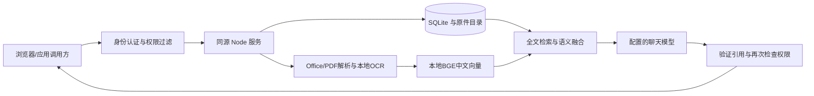

# X-RAG 部署与运维手册

## 1. 部署构成

浏览器访问同源网页和 API。Node.js 24 服务保存账号、知识元数据、任务、会话和审计到 SQLite，原件保存到 `DATA_DIR/uploads`。本地 BGE 模型负责生成语义向量；聊天模型收到当前账号有权访问、已经发布并生效的相关片段，生成带出处的回答。



不需要单独安装数据库、Redis 或向量数据库。该结构减少试点运维成本，也意味着当前为单节点设计，不支持多个服务共享同一数据目录或跨节点队列。

## 2. 本机运行

1. 安装 Node.js 24+。在项目目录执行 `npm ci`。
2. 新环境复制 `.env.example` 为 `.env.local` 并在本机编辑；已有配置不要覆盖。
3. 完整交付包含公开模型文件，执行 `npm run model:verify` 检查完整性和离线推理。只有模型缺失时才执行 `npm run model:prepare` 下载。
4. 执行 `npm run check`，通过后执行 `npm start`。
5. 从同一服务器访问 `http://localhost:8787` 创建首位管理员。没有默认密码。
6. Windows 可执行 `powershell -ExecutionPolicy Bypass -File scripts/protect-local.ps1` 保护当前项目的实际配置和数据目录。Linux 将配置设为仅服务账号可读、数据目录仅服务账号可写。

服务默认只监听本机地址。程序启动成功后仍应检查 `/ready.json`，返回 `status=ready` 才代表数据库与原件目录可读写、写入锁持有成功。

开发方式：`npm run dev` 同时启动后台和 5173 页面，页面代理 `/api` 到后台。不要重复启动占用同一端口或数据目录的实例。修改后端代码或本地环境配置后需要重启后台；前端正式构建更新需重新执行 `npm run build`。

## 3. 主要配置

| 参数 | 用途 |
| --- | --- |
| `API_HOST` / `API_PORT` | 监听地址与端口，默认 127.0.0.1:8787 |
| `DATA_DIR` | 持久数据目录，含数据库、原件、备份和本机加密密钥 |
| `DEEPSEEK_API_KEY`、`AI_BASE_URL`、`AI_MODEL` | 当前聊天服务；也可使用 `AI_API_KEY` 配置 OpenAI 兼容服务 |
| `LOCAL_EMBEDDINGS_ENABLED` | 默认开启本地中文向量，`false` 可明确关闭 |
| `EMBEDDING_BASE_URL` / `EMBEDDING_MODEL` / `EMBEDDING_API_KEY` | 可选独立向量服务；完整配置后优先使用该服务 |
| `MODEL_ALLOWED_HOSTS` | 内网 HTTPS 模型的精确主机名白名单，逗号分隔；不对 Webhook 生效 |
| `CONNECTOR_ROOTS` | 已存在的来源目录白名单，多个目录以分号分隔 |
| `BACKUP_INTERVAL_HOURS` | 自动备份间隔；0 关闭，建议按实际恢复点要求设置 |
| `ALLOWED_ORIGINS` | 浏览器允许写入的完整来源地址，英文逗号分隔，必须包含实际使用地址 |
| `PUBLIC_ORIGIN` | 正式访问地址，也是 OIDC 回调的基础地址 |
| `COOKIE_SECURE` | HTTPS 部署设为 `true`；本地 HTTP 不应开启 |
| `ADMIN_USERNAME` / `ADMIN_PASSWORD` / `ADMIN_NAME` | 无任何账号时的服务端初始化，适合容器；初始化后移除 |
| `APP_ENCRYPTION_KEY` | 可选外部保管的凭据加密密钥，启用后恢复必须使用同一值 |

平台设置页面保存的模型配置优先于环境配置；空密钥输入表示保留现有密钥。更新过页面设置后，单改 `.env.local` 的对应字段可能不会覆盖页面保存值，应在平台设置中核实当前配置。

模型密钥保留在服务器。数据库中的管理页面模型密钥和 Webhook 密钥使用本机密钥加密；会话及应用令牌只保存摘要。业务原文、知识片段和备份仍需由部署环境实施磁盘加密及访问控制。

## 4. 正式服务与 HTTPS

使用进程管理器或系统服务运行 `node --env-file-if-exists=.env.local server/api.mjs`，设置工作目录为项目根目录、使用专用服务账号并启用异常重启。Windows 可由运维通过任务计划程序在系统启动时运行；Linux 可配置 systemd。交付文件不会擅自安装系统服务。

推荐反向代理终止 HTTPS，后台监听 127.0.0.1:8787。代理需保留浏览器 Origin，允许最大约 36MB 的请求体，并将聊天请求超时设为至少 250 秒（独立向量服务与聊天请求可能顺序执行）。设置 `PUBLIC_ORIGIN=https://实际域名`、`ALLOWED_ORIGINS=https://实际域名` 和 `COOKIE_SECURE=true`。如果从远程首次部署，使用安全注入的初始化账号变量；不要直接对公网开放未初始化服务。

服务不信任 X-Forwarded-For 作为客户端身份，登录限流按实际连接来源/IP 与账号控制；部署共享代理后应由网关同时执行用户、设备和来源限流。

## 5. Docker Compose

已提供 `Dockerfile`、`compose.yaml`。在目标服务器配置 `.env.local`，为首次容器启动注入强管理员账号，执行：

```text
docker compose build
docker compose up -d
docker compose ps
```

镜像包含生产网页、后台、公开中文模型、离线 OCR 依赖和 Poppler。容器以非 root 用户运行，命名卷保存数据，`knowledge-sources` 目录只读挂载。默认只向宿主机 127.0.0.1 暴露端口。首次创建管理员后从配置移除初始化密码并重建容器实例；持久卷中的账号继续有效。

当前开发机未安装 Docker，引擎实际构建、卷权限、代理和重启验证须在部署目标执行。不要把环境配置加入镜像或分发包。

## 6. 备份与恢复

服务运行时，在“运行保障”点击“立即备份”；自动备份通过 `BACKUP_INTERVAL_HOURS` 配置。服务停止时可用 `npm run backup`。备份包括 SQLite 一致性快照、数据库中引用的全部原件、SHA-256 清单及默认本机加密密钥。外部 `APP_ENCRYPTION_KEY` 不写入备份，必须单独保管。

恢复到新的空目录，不覆盖现有数据：

```powershell
npm run restore -- "D:\安全备份\backup-日期" --target "D:\ai-project\ai-rag\data-restored"
```

恢复程序先验证数据库、原件数量与哈希，使用恢复标记阻止半成品启动，成功后清除旧登录会话。再停止原服务，调整 `DATA_DIR` 指向恢复目录，保留匹配的凭据加密密钥并启动；检查 `/ready.json`、账号登录、已发布文档和原件下载。保留原数据目录，验证完成后再按照企业保留策略处置。

备份默认位于数据盘，管理员应将完整备份目录复制到企业备份介质或另一故障域，限制读取权限并定期演练恢复。系统不自动清理旧备份；保留周期和磁盘告警由部署运维负责。

## 7. 模型与索引维护

`models/Xenova/bge-small-zh-v1.5/manifest.json` 固定来源版本和每个文件的校验值。`npm run model:verify` 验证完整性、512 维归一化以及中文语义排序；运行中的模型加载禁止远程下载。

上传和校对后自动生成语义索引，启动及定时巡检补齐已发布/待审核文档的缺失索引。模型签名含服务地址和模型标识，旧模型的向量不会与新模型混用。失败任务可重试；管理员可通过文档重建索引入口或 `POST /api/documents/:id/reindex` 重新生成，保留人工校对内容。全文检索在语义服务不可用时仍可使用。

BGE 模型来源与许可证见模型目录的来源清单和上游说明：[ONNX 版本](https://huggingface.co/Xenova/bge-small-zh-v1.5)、[原始 BGE 模型](https://huggingface.co/BAAI/bge-small-zh-v1.5)。聊天模型能力以配置服务的实际账号返回结果为准。

## 8. 已知限制与故障处理

| 现象或边界 | 处理 |
| --- | --- |
| 端口占用、写入锁被占用 | 找到本项目原服务并正常停止；不要删除活跃写入锁或同时启动另一个写入者 |
| 凭据加密密钥缺失/错误 | 从对应备份恢复匹配密钥；系统拒绝静默改用新密钥 |
| 解析失败、OCR 为空 | 查看处理任务的明确原因，替换清晰原件后重试；审核前校对识别结果 |
| 模型不可用 | 检查平台设置连接测试、服务权限和用量；页面会标识原文摘录或失败原因 |
| 搜索不到资料 | 核对知识库权限、文档审核状态、生效/失效时间、是否被新版本替代 |
| Office 页码 | DOCX 为解析逻辑页，PPTX 为幻灯片，XLSX 为工作表；以原件核验版式 |
| 文件规模 | 单文件 25MB，解析文本最多 200 万字符，PDF/文档页最多 1000，OCR 最多 20 页 |
| 扫描图片 | 超大图像和多页 TIFF 明确拒绝；多页 TIFF 请拆页或转换 PDF |
| Office 图表/嵌图 | 主要提取文本和表格，嵌入图形不是完整视觉理解；解析警告需人工确认 |
| 目录同步 | 仅白名单下最多 2000 个支持文件、最多 20 层；跳过符号链接；不提供任意网页爬取 |
| 容量与高可用 | 无集群、跨机容灾自动切换或已验证大规模吞吐承诺，扩大使用前先压测 |

统计基于真实数据；运行请求数、进程运行时间等部分指标在重启后重新计数，问答和用量累计指标持久化。平均 API 耗时按本次运行已完成请求计时；问答检索与生成的耗时样本持久化，不对旧的无耗时记录进行估算。评测通过率是所选测试集规则结果，不应对外表述为通用准确率。

## 后台数据库与文档存储建设

部署需要建立业务数据库及文档数据库的持久化体系，来源目录不能替代文档数据库。本手册所述“不需要单独安装数据库”仅指当前单节点版本使用内置 SQLite，不表示无需建设数据库与文档存储。建设对象、当前实现及后续要求见 [后台数据与文档数据库建设说明](后台数据与文档数据库建设说明.md)。
